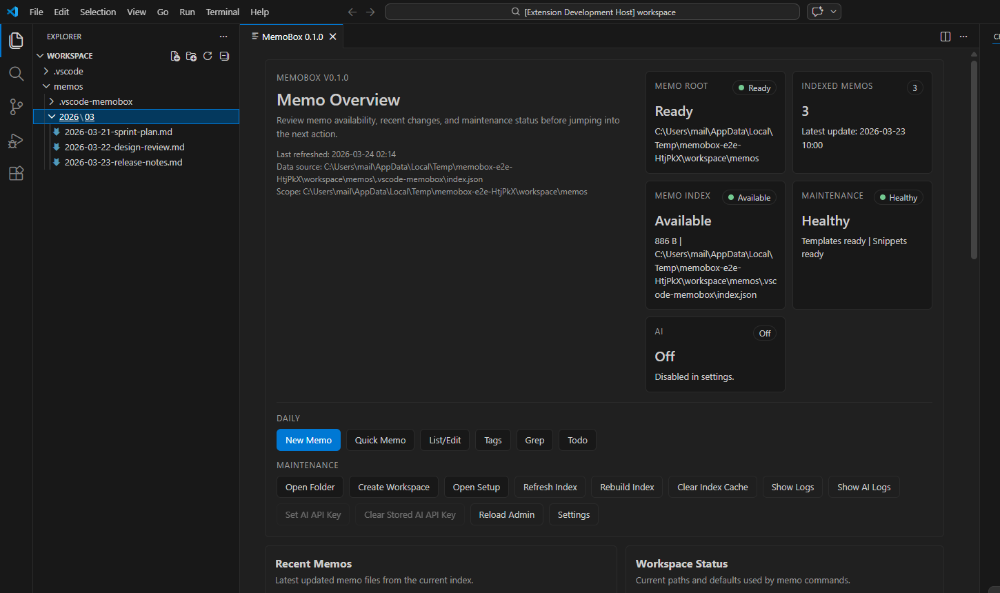
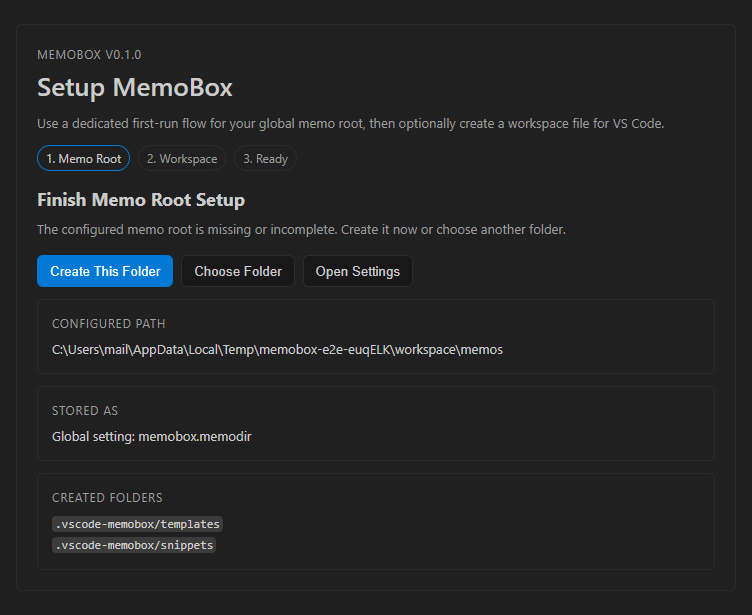
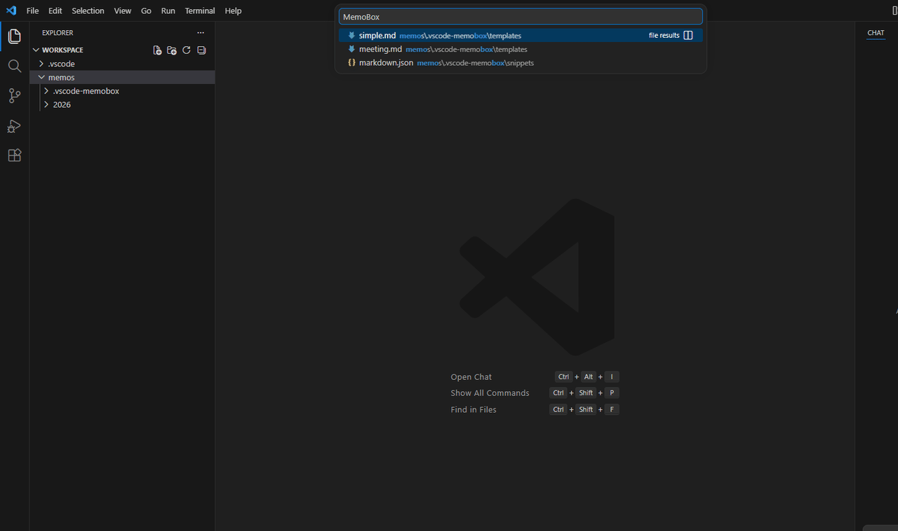
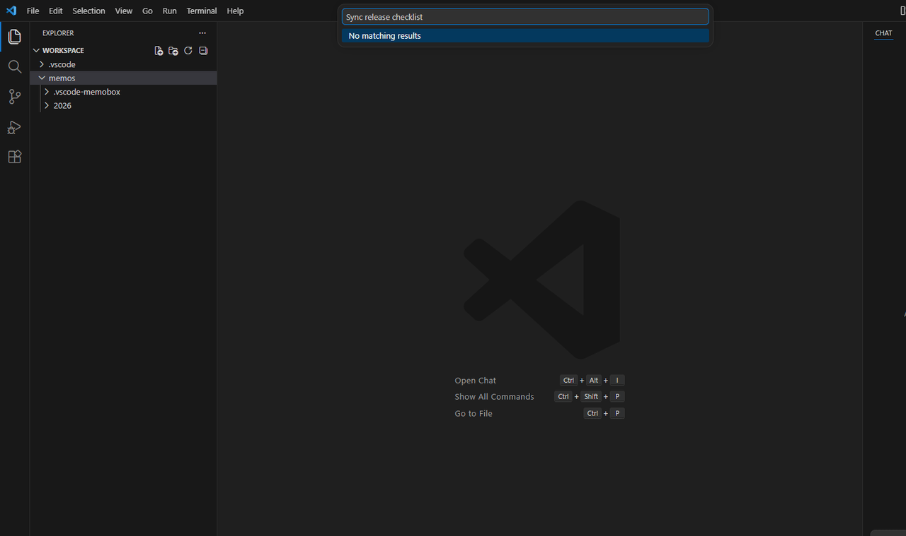
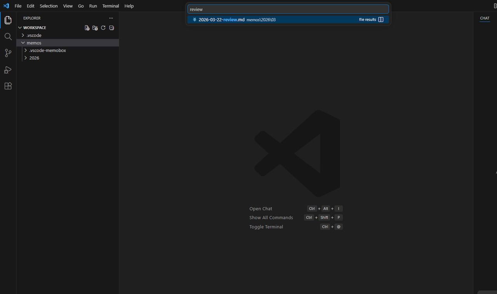
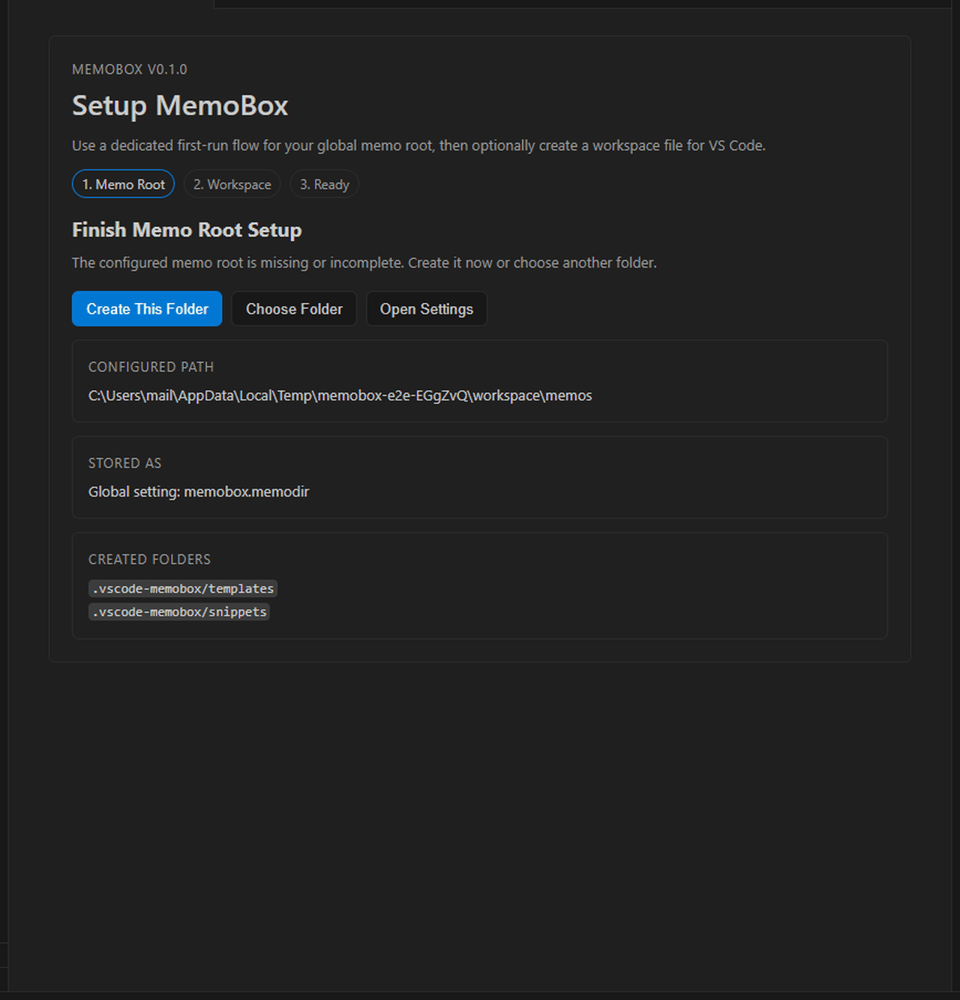
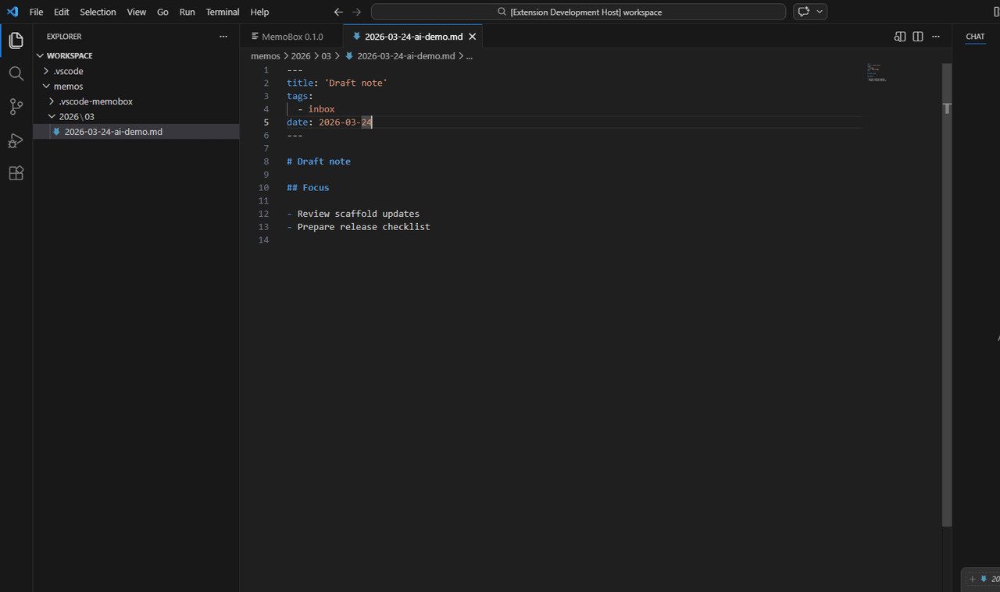

# MemoBox

[English README](./README.md)

MemoBox は、日次メモ運用向けの VS Code 拡張です。保守しやすい構造、実用的なメモ操作、そしてオプトインの AI 機能を重視しています。

## 現在の状態

- リリース系統: `0.1.x`
- 現在の重点: 安定性、保守性、リリース準備
MemoBox はすでに日常利用できる状態です。残っている `0.1.x` の作業は、大きな機能追加よりも UX の調整、耐障害性、パッケージ品質の改善が中心です。

## スクリーンショット

管理画面:



初回セットアップ:



操作デモ:



クイックメモ:



検索:



セットアップ:


 
AI:



## 主な機能

- 日付付きメモの新規作成とテンプレート選択
- 今日のメモへのクイック追記
- 一覧・編集、タグ閲覧、grep、todo 抽出、関連メモ提示
- 相対メモリンク挿入と Markdown リンク補完
- Admin ダッシュボード、Setup フロー、ワークスペースファイル生成
- バックアップ復旧と増分更新に対応した永続メモインデックス
- 同梱 scaffold からのテンプレート・スニペット初期生成
- コマンド、設定、Admin UI、Setup UI の多言語対応
- MemoBox / AI 用 OutputChannel ログ
- タイトル生成、要約、タグ提案、翻訳、Q&A、レポート、リンク提案などの任意 AI 支援

## コマンド

日常利用:

- `MemoBox: 新規メモ`
- `MemoBox: 今日のクイックメモ`
- `MemoBox: 一覧 / 編集`
- `MemoBox: タグから開く`
- `MemoBox: メモリンクを挿入`
- `MemoBox: 検索`
- `MemoBox: Todo`
- `MemoBox: 関連メモ`
- `MemoBox: 日付を今日に変更`
- `MemoBox: Markdown をブラウザで開く`

セットアップ・メンテナンス:

- `MemoBox Admin: 管理画面を開く`
- `MemoBox Admin: Setup を開く`
- `MemoBox Admin: 設定を開く`
- `MemoBox Admin: ワークスペースを作成`
- `MemoBox Admin: メモフォルダを開く`
- `MemoBox Admin: インデックスを更新`
- `MemoBox Admin: インデックスを再構築`
- `MemoBox Admin: インデックスキャッシュを削除`
- `MemoBox Admin: ログを開く`
- `MemoBox Admin: AI ログを開く`

AI コマンドは `memobox.aiEnabled` を有効化するまで表示されません:

- `MemoBox: AI タイトル生成`
- `MemoBox: AI 要約`
- `MemoBox: AI タグ提案`
- `MemoBox: AI 校正`
- `MemoBox: AI 翻訳`
- `MemoBox: AI 質問`
- `MemoBox: AI テンプレート提案`
- `MemoBox: AI レポート`
- `MemoBox: AI リンク提案`
- `MemoBox: AI API キーを保存`
- `MemoBox: AI API キーを削除`

既定キーバインド:

- `Ctrl+Alt+N` で `新規メモ`
- `Ctrl+Alt+T` で `今日のクイックメモ`
- `Ctrl+Alt+G` で `検索`
- `Ctrl+Alt+Shift+M` で `管理画面を開く`

## 日常の使い方

`MemoBox: 新規メモ` は、`memobox.memodir` 配下に `memobox.datePathFormat` に従った日付付きメモを作成します。`.vscode-memobox/templates/*.md` のテンプレート選択、選択文字列やクリップボードからのファイル名生成、日付サフィックス付与に対応しています。

`MemoBox: 今日のクイックメモ` は今日のメモへ時刻付きブロックを追記します。追記見出しの形式は `titlePrefix` と `dateFormat` で制御します。

`MemoBox: メモリンクを挿入` は、別メモへの相対 Markdown リンクを挿入します。`[[...` や `[Label](` の入力中にも補完が働き、長めのクエリでは軽い typo 許容も入っています。

## コマンドランチャー

`MemoBox: Commands` は、Daily / Context / Maintenance / AI に分かれた QuickPick ランチャーを開きます。グローバルなコマンドパレットより対象を絞って使いたい場合に便利です。

## テンプレートとスニペット

MemoBox は [`resources/scaffold`](/C:/Users/mail/Documents/git/vscode-memobox/resources/scaffold) から初期テンプレートとスニペットをメタディレクトリへ展開します。現在の標準 scaffold は次の 3 つです。

- `simple.md`
- `meeting.md`
- `memo.json`

既定テンプレートは YAML frontmatter 付きで、少なくとも次を含みます。

- `title`
- `tags`
- `date`

`simple.md` には初期タグとして `inbox` が入っています。テンプレートとスニペットの格納先は、標準のメタディレクトリ配下でも、設定で指定した絶対パスでも使えます。

## インデックスの仕組み

MemoBox はメモファイルのメタデータインデックスを永続化しています。保存するのはパス、タイムスタンプ、サイズ、frontmatter の `title` と `tags` で、本文全体はキャッシュしません。

現在の挙動:

- 初回読込では `primary -> backup -> transient backup` の順で persisted index を読み込みます
- 通常編集では save / create / delete / rename イベントに応じて増分更新します
- フル再帰走査は初回、明示的 refresh/rebuild、不明な変更源、定期検証時だけに限定します
- 読み込めないファイルは全体失敗にせずスキップします
- 安全書き込みは temp ファイルと backup ファイルを併用して破損耐性を上げています

この index は次の機能で使われます。

- `一覧 / 編集`
- `タグから開く`
- `関連メモ`
- `検索`
- `Todo`
- メモリンク挿入と補完
- Admin の集計表示

## Admin と Setup

MemoBox には 2 つの Webview があります。

- `Setup`
  初回セットアップや修復フローに使います。まず `memobox.memodir` をグローバル設定へ保存し、その後で任意の `.code-workspace` 作成へ進みます。
- `Admin`
  Recent、Pinned、タグ、テンプレート、スニペット、AI 状態、ログ、index 状態を確認する運用ダッシュボードです。

Admin では `memobox.adminOpenOnStartup` の切り替えもできます。

## AI

AI は明示的なオプトインです。

- `memobox.aiEnabled`
  既定値: `false`
- `memobox.ai`
  provider profile、timeout、network 設定などをまとめた JSON

AI を無効にしている間は:

- コマンドパレットに AI コマンドは出ません
- Markdown エディタの右クリックメニューにも AI 項目は出ません

API キーの解決順は次の通りです。

1. settings JSON
2. VS Code SecretStorage
3. `apiKeyEnv`

OpenAI 系 profile では、settings JSON 直書きより SecretStorage または環境変数の利用を推奨します。

## ログ

MemoBox は 2 つの VS Code OutputChannel にログを出します。

- `MemoBox`
- `MemoBox AI`

ログレベルは `memobox.logLevel` で制御できます。

- `off`
- `error`
- `warn`
- `info`

Admin には両方のログを開くボタンがあります。

## 設定

現在の主な設定項目:

- `memobox.memodir`
- `memobox.datePathFormat`
- `memobox.memotemplate`
- `memobox.metaDir`
- `memobox.templatesDir`
- `memobox.snippetsDir`
- `memobox.titlePrefix`
- `memobox.dateFormat`
- `memobox.memoNewFilenameFromClipboard`
- `memobox.memoNewFilenameFromSelection`
- `memobox.memoNewFilenameDateSuffix`
- `memobox.listSortOrder`
- `memobox.listDisplayExtname`
- `memobox.displayFileBirthTime`
- `memobox.openMarkdownPreview`
- `memobox.searchMaxResults`
- `memobox.excludeDirectories`
- `memobox.maxScanDepth`
- `memobox.grepViewMode`
- `memobox.todoPattern`
- `memobox.relatedMemoLimit`
- `memobox.recentCount`
- `memobox.adminOpenOnStartup`
- `memobox.locale`
- `memobox.logLevel`
- `memobox.aiEnabled`
- `memobox.ai`

## 開発

必要環境:

- Node.js `20.19.0`
- npm `10.x`

主なコマンド:

```bash
npm install
npm run build
npm run lint
npm run test
npm run validate
npm run test:e2e
npm run capture:readme-screenshots
npm run capture:readme-gif
```

VS Code 上で拡張を起動する手順:

1. このリポジトリを VS Code で開く
2. `npm install` を実行
3. `F5` で Extension Development Host を起動
4. コマンドパレットから `MemoBox Admin: 管理画面を開く` を実行

## パッケージとテスト

- Unit test では index、grep/todo、tags、related memos、templates、snippets、logging、link completion などの純粋ロジックを検証しています
- Playwright E2E では Setup、Admin pin/unpin、新規メモのテンプレート選択、Grep/Todo、設定グループ、AI コマンド表示制御を確認しています
- VSIX には [`.vscodeignore`](/C:/Users/mail/Documents/git/vscode-memobox/.vscodeignore) で docs、tests、Playwright assets、scripts、source maps などを含めないようにしています

VSIX を作成するには:

```bash
npm run package:vsix
```

## リポジトリ構成

```text
src/
  core/         ドメインロジックと設定
  features/     VS Code コマンドと UI
  infra/        AI など provider 依存の統合
  shared/       共通ヘルパーと拡張メタ情報
test/           純粋モジュール向け unit test
docs/           プロダクトメモと設計メモ
resources/      scaffold と webview テンプレート
```

## License

MIT

MemoBox は、[satokaz/vscode-memo-life-for-you](https://github.com/satokaz/vscode-memo-life-for-you) に影響を受けて開発しています。個人的に使いたい機能を詰め込んだ実験的な拡張機能です。
